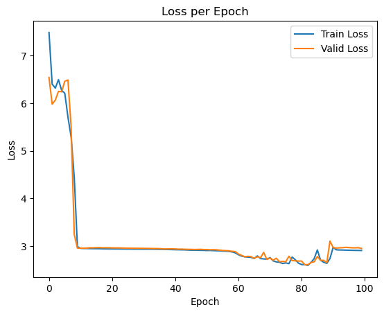
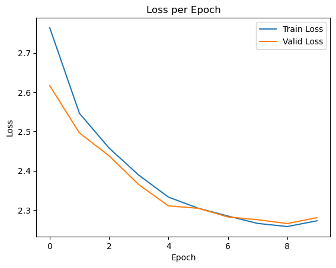

# final-ds-ua-301

This project is an attempt to recreate the speech synthesizer built by [Michael Phi](https://youtu.be/YereI6Gn3bM) using research done on other public speech synthesizer repositories and the famous [Deep Speech 2](https://arxiv.org/pdf/1512.02595.pdf) paper.

To use, download [Common Voice Data](https://commonvoice.mozilla.org/en/datasets) from their website and run the testTrainSplit.ipynb file, with your own file paths specified.

Training was done with a pretrained model found at the following link: [link to open source model](https://drive.google.com/drive/folders/14ljfpvisK1tz8fvFYETbdWqR3lOmJ_2Y)

The loss that I experienced using random weight initialization is as follows: 

The loss greatly decreased when using another pretrained model's weights and is shown as follows:

The great obstacle for completing this task and arriving at a consistent model for speech recognition is the size of the data being used to do the training. As discussed in the above paper, over 11,000 hours of voice data is needed for success whereas I use only about 3,000. Running the training on about 10 epochs has shown itself to be enough for the model to learn the proper weights with 100 epochs leading to overfitting. If more data is plugged into this model, I am confident that it will consistently produce highly accurate speech to text transcriptions.
